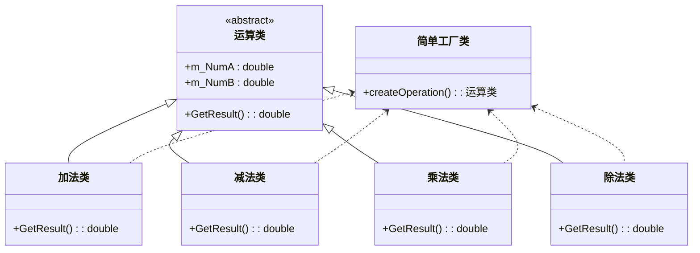

# 简单工厂模式

## UML 图

```mermaid
classDiagram
class 运算类{
	<<abstract>>
	+m_NumA : double
	+m_NumB : double
	+GetResult() : double
}

class 加法类{
	+GetResult() : double
}

class 减法类{
	+GetResult() : double
}

class 乘法类{
	+GetResult() : double
}

class 除法类{
	+GetResult() : double
}

class 简单工厂类 {
	+createOperation() : 运算类
}

运算类 <|-- 加法类
运算类 <|-- 减法类
运算类 <|-- 乘法类
运算类 <|-- 除法类
简单工厂类 <.. 加法类
简单工厂类 <.. 减法类
简单工厂类 <.. 乘法类
简单工厂类 <.. 除法类
```